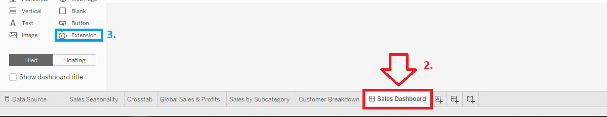

# Navodila za namestitev

## Inštalacija Tableau Desktop
 1. Na tej [spletni strani](https://www.tableau.com/products/trial) lahko dobite free trial za Tableau Desktop.
 2. Prenos aplikacije se bo avtomatsko začel, po namestitvi se lahko registrirate za free trial.

## Postavitev okolja
 1. Poženite `git clone https://github.com/akulakul/Tableau-Sample-Extension.git` v željenem direktoriju.
 2. Nato v korenu direktorija Tableau-Sample-Extensions, torej `~\Tableau-Sample-Extension\` poženite ukaz `npm install`.
 3. V isti mapi poženite spletni strežnik z ukazom `npm start`.
 4. Ukaz `npm install` poženite še v `~\Tableau-Sample-Extensions\zebraBI\sample_extension\`.

 ## Zagon Tableau-ja in vizualizacije
 1. V `~\Tableau-Sample-Extension\zebraBI\` odprite datoteko `Workbook.twbx`.
 2. Spodaj izberite `Sales Dashboard`
    
 3. Kliknite in povlecite gumb `Extensions` (3.) na dashboard. Kliknite `My Extensions`.
 4. Izberite `test.trex` v `~\Tableau-Sample-Extension\zebraBI\sample_extension\` in pritisnite OK.
 5. Izberite `Global Sales & Profits`. (Ostale opcije ne bojo delovale, ker so vse vrednosti hardcoded v program)

## Tableau Developer Program
 1. Na tej [spletni strani](https://www.tableau.com/developer) se lahko registrirate za Tableau-jev developer program.
 2. S tem računom se lahko prijavite v [Tableau Online](https://online.tableau.com/), ki ponuja večino funckionalnosti Tableau Desktop-a.

 # Kako do scatterplota
 
 ## Namestitev Tableau Extensions API SDK
 1. Z ukazom `git clone https://github.com/tableau/extensions-api.git` lahko prenesete potrebne datoteke za razvoj extensionov. Lahko jih prenesete tudi s [spletne strani](https://github.com/tableau/extensions-api/archive/master.zip).
 2. Naredite drugi in tretji korak iz odstavka "Postavitev okolja", torej (`npm install` in `npm start`, če želite pognati spletni strežnik).
 3. [Hello world extension](https://github.com/tableau/extensions-api/archive/master.zip)